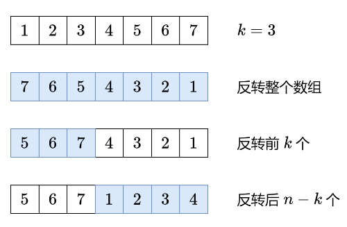

# [189. 轮转数组] 
## (https://leetcode.cn/problems/rotate-array/description/?envType=study-plan-v2&envId=top-100-liked)

#### **标签** 数组 | 数学 | 双指针


### 问题描述
给定两个字符串 s 和 p，找到 s 中所有 p 的 异位词 的子串，返回这些子串的起始索引。不考虑答案输出的顺序。

字母异位词是通过重新排列不同单词或短语的字母而形成的单词或短语，并使用所有原字母一次
### 解法分析（详细注释见Java文件）
### 方法1 反转



**时间复杂度**: O(n)
**空间复杂度**: O(1)
```java
class Solution {
    public void rotate(int[] nums, int k) {
        k%=nums.length;
        reverse(nums,0,nums.length-1);
        reverse(nums,0,k-1);
        reverse(nums,k,nums.length-1);
    }

    private void reverse(int[] nums,int i,int j){
        while(i<j){
            int c=nums[i];
            nums[i++]=nums[j];
            nums[j--]=c;
        }
    }
}
```

### 比较与总结
#### 不同之处：

#### 选择哪种方法？


### 特殊处理
此题目无特殊处理
