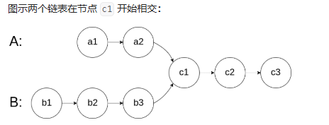

# [160. 相交链表] 
## (https://leetcode.cn/problems/intersection-of-two-linked-lists/description/?envType=study-plan-v2&envId=top-100-liked)

#### **标签** 哈希表 | 链表 | 双指针


### 问题描述
给你两个单链表的头节点 headA 和 headB ，请你找出并返回两个单链表相交的起始节点。如果两个链表不存在相交节点，返回 null 。
题目数据 保证 整个链式结构中不存在环。

注意，函数返回结果后，链表必须 保持其原始结构 。


### 解法分析（详细注释见Java文件）
### 方法1 双指针


**时间复杂度**: O(n+m) m 和 n 是分别是链表 headA 和 headB 的长度
**空间复杂度**: O(1)
```java
/**
 * Definition for singly-linked list.
 * public class ListNode {
 *     int val;
 *     ListNode next;
 *     ListNode(int x) {
 *         val = x;
 *         next = null;
 *     }
 * }
 */
public class Solution {
    public ListNode getIntersectionNode(ListNode headA, ListNode headB) {
        if(headA == null || headB == null) return null;
        ListNode pa=headA,pb=headB;
        while(pa != pb){
            pa= (pa==null) ? headB : pa.next;
            pb= (pb==null) ? headA : pb.next;
        }
        return pa;
    }
}
/*
4 1 8 4 5/5 6 1 8 4 5 
5 6 1 8 4 5 /4 1 8 4 5 */
```
### 方法2 哈希集合


**时间复杂度**: O(n+m)
**空间复杂度**: O(m)
```java
/**
 * Definition for singly-linked list.
 * public class ListNode {
 *     int val;
 *     ListNode next;
 *     ListNode(int x) {
 *         val = x;
 *         next = null;
 *     }
 * }
 */
public class Solution {
    public ListNode getIntersectionNode(ListNode headA, ListNode headB) {
        Set<ListNode> visited = new HashSet<ListNode>();
        ListNode temp = headA;
        while (temp != null) {
            visited.add(temp);
            temp = temp.next;
        }
        temp = headB;
        while (temp != null) {
            if (visited.contains(temp)) {
                return temp;
            }
            temp = temp.next;
        }
        return null;
    }
}
```
### 比较与总结
#### 不同之处：

#### 选择哪种方法？


### 特殊处理
此题目无特殊处理
