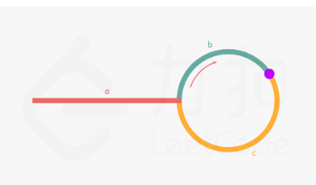

# [142. 环形链表 II] 
## (https://leetcode.cn/problems/linked-list-cycle-ii/description/?envType=study-plan-v2&envId=top-100-liked)

#### **标签** 哈希表 | 双指针 | 链表


### 问题描述
给你一个链表的头节点 head ，判断链表中是否有环。

如果链表中有某个节点，可以通过连续跟踪 next 指针再次到达，则链表中存在环。 为了表示给定链表中的环，评测系统内部使用整数 pos 来表示链表尾连接到链表中的位置（索引从 0 开始）。注意：pos 不作为参数进行传递 。仅仅是为了标识链表的实际情况。

如果链表中存在环 ，则返回 true 。 否则，返回 false 。

### 解法分析（详细注释见Java文件）
### 方法1 哈希表


**时间复杂度**: O(n)
**空间复杂度**: O(n)
```java
/**
 * Definition for singly-linked list.
 * class ListNode {
 *     int val;
 *     ListNode next;
 *     ListNode(int x) {
 *         val = x;
 *         next = null;
 *     }
 * }
 */
public class Solution {
    public ListNode detectCycle(ListNode head) {
        Map<ListNode,Integer> map = new HashMap<>();
        ListNode code = head;
        while(code!=null){
            if(map.containsKey(code)){
                return code;
            }
            else map.put(code,1);
            code=code.next;
        }
        return null;
    }
}
```
### 方法2 双指针

fast = a + b + n(b+c)
slow = a + b
但是因为fast和slow初始位置一样，fast的速度是2*slow
那么路程：fast = slow * 2
        即：a + (n+1)b + nc = 2(a+b) ⟹ a = c + (n−1)(b+c)
那么我们需要的入环点的索引（a的大小），就是 slow剩下的半圈 + 若干整圈
那么可以用新指针指向head，迭代到新指针==slow，
    那么他们走相遇后的路程就分别是 a 和 c + (n−1)(b+c)
所以这个时候temp指向的就是入环点
**时间复杂度**: O(n)
**空间复杂度**: O(1)
```java
/**
 * Definition for singly-linked list.
 * class ListNode {
 *     int val;
 *     ListNode next;
 *     ListNode(int x) {
 *         val = x;
 *         next = null;
 *     }
 * }
 */
public class Solution {
    public ListNode detectCycle(ListNode head) {
        if (head == null || head.next == null) {
            return null;
        }
        ListNode fast = head,slow = head;
        while(fast != null){
            if(fast == null || fast.next == null) return null;
            fast=fast.next.next;
            slow=slow.next;
            if(fast == slow){
                ListNode temp = head;
                while(temp != slow){
                    temp=temp.next;
                    slow=slow.next;
                }
                return temp;
            }
        }
        return null;
        
    }
}
```
### 比较与总结
#### 不同之处：

#### 选择哪种方法？


### 特殊处理
此题目无特殊处理
