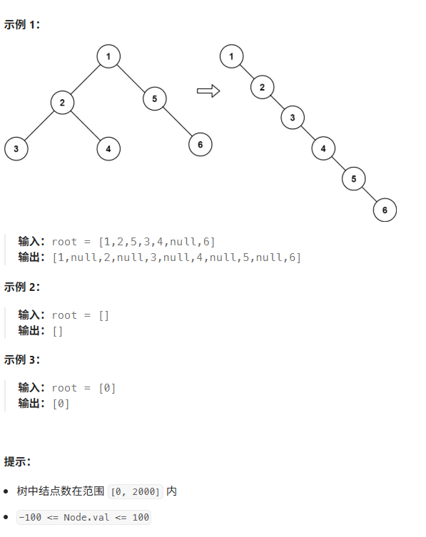

# [114. 二叉树展开为链表] 
## (https://leetcode.cn/problems/flatten-binary-tree-to-linked-list/description/?envType=study-plan-v2&envId=top-100-liked)

#### **标签** 
栈
树
深度优先搜索
链表
二叉树


### 问题描述
给你二叉树的根结点 root ，请你将它展开为一个单链表：

展开后的单链表应该同样使用 TreeNode ，其中 right 子指针指向链表中下一个结点，而左子指针始终为 null 。
展开后的单链表应该与二叉树 先序遍历 顺序相同。

### 解法分析（详细注释见Java文件）

```java
/**
 * Definition for a binary tree node.
 * public class TreeNode {
 *     int val;
 *     TreeNode left;
 *     TreeNode right;
 *     TreeNode() {}
 *     TreeNode(int val) { this.val = val; }
 *     TreeNode(int val, TreeNode left, TreeNode right) {
 *         this.val = val;
 *         this.left = left;
 *         this.right = right;
 *     }
 * }
 */
class Solution {
    public void flatten(TreeNode root) {
        while(root != null){
            if(root.left == null){
                root = root.right;
            }else{
                TreeNode temp = root.right;
                root.right = root.left;
                root.left = null;
                TreeNode you = root;
                while(you.right != null){
                    you = you.right;
                }
                you.right = temp;
                root = root.right;
            }
        }
    }
} 
```
解释：
```java
**    1
   / \
  2   5
 / \   \
3   4   6

//将 1 的左子树插入到右子树的地方
    1
     \
      2         5
     / \         \
    3   4         6        
//将原来的右子树接到左子树的最右边节点
    1
     \
      2          
     / \          
    3   4  
         \
          5
           \
            6
            
 //将 2 的左子树插入到右子树的地方
    1
     \
      2          
       \          
        3       4  
                 \
                  5
                   \
                    6   
        
 //将原来的右子树接到左子树的最右边节点
    1
     \
      2          
       \          
        3      
         \
          4  
           \
            5
             \
              6         
  
  ......

```
### 比较与总结
#### 不同之处：

#### 选择哪种方法？


### 特殊处理
此题目无特殊处理
